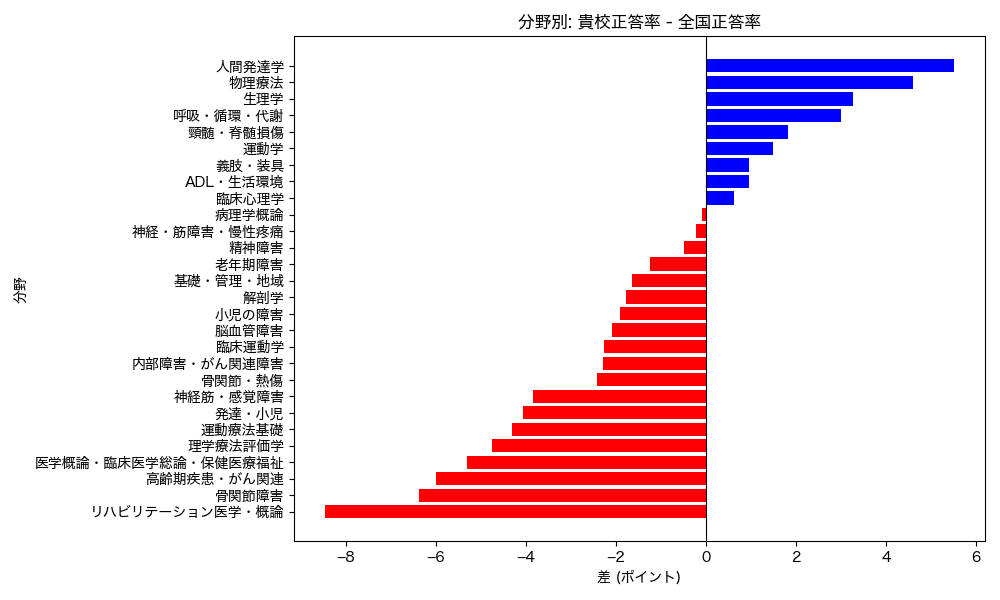

# 試験結果分析レポート: 全国平均との比較

## 分析概要
`question.csv` のデータに基づき、貴校の正答率と全国平均正答率を比較分析しました。
分析の焦点は以下の2点です。

1.  **分野別比較**: 分野ごとの平均正答率を比較し、全体的な傾向を把握する。
2.  **個別問題の抽出**: 全国平均より著しく低い（-10ポイント以下）問題を特定する。

## 1. 重点対策が必要な分野 (ワースト5)
以下の分野は、全国平均と比較して特に差が開いており、優先的な対策が推奨されます。

| 順位 | 分野名 | 平均差(ポイント) | 貴校平均(%) | 全国平均(%) |
| :---: | :--- | :---: | :---: | :---: |
| 1 | リハビリテーション医学・概論 | **-8.5** | 53.5 | 62.0 |
| 2 | 骨関節障害 | **-6.4** | 50.5 | 56.9 |
| 3 | 高齢期疾患・がん関連 | **-6.0** | 26.5 | 32.5 |
| 4 | 医学概論・臨床医学総論・保健医療福祉 | **-5.3** | 21.4 | 26.7 |
| 5 | 理学療法評価学 | **-4.7** | 52.0 | 56.7 |

*(詳細は下部の「全分野詳細テーブル」を参照)*

## 2. 視覚化: 分野別パフォーマンスギャップ

*グラフ: 全国平均との差（左に伸びる赤色のバーが大きいほど、全国より低いことを示します）*

## 3. 特に改善が必要な個別問題
全国平均よりも **10ポイント以上** 低い問題の一覧です。これらは授業内容や教材との整合性を確認することをお勧めします。

- **最大乖離**: 内部障害・がん関連障害の**問77** (差: -29.2ポイント)
- **基礎・管理・地域**: 複数の問題(問48, 21)で大幅な低下が見られます。

| 分野 | 問題番号 | 貴校(%) | 全国(%) | 差 |
| :--- | :---: | :---: | :---: | :---: |
| 内部障害・がん関連障害 | 77 | 41.8 | 71.0 | **-29.2** |
| 神経・筋障害・慢性疼痛 | 89 | 27.6 | 46.4 | **-18.8** |
| 基礎・管理・地域 | 48 | 25.5 | 44.1 | **-18.6** |
| 神経筋・感覚障害 | 15 | 22.4 | 40.4 | **-18.0** |
| 基礎・管理・地域 | 21 | 29.6 | 45.6 | **-16.0** |
*(他、計21問が該当)*

## 補足: 全分野詳細テーブル
| 分野 | 問題数 | 貴校平均(%) | 全国平均(%) | 差(ポイント) |
| :--- | :---: | :---: | :---: | :---: |
| リハビリテーション医学・概論 | 2 | 53.5 | 62.0 | -8.5 |
| 骨関節障害 | 6 | 50.5 | 56.9 | -6.4 |
| 高齢期疾患・がん関連 | 1 | 26.5 | 32.5 | -6.0 |
| 医学概論・臨床医学総論・保健医療福祉 | 1 | 21.4 | 26.7 | -5.3 |
| 理学療法評価学 | 10 | 52.0 | 56.7 | -4.7 |
| 運動療法基礎 | 3 | 58.5 | 62.8 | -4.3 |
| 発達・小児 | 6 | 39.1 | 43.2 | -4.1 |
| 神経筋・感覚障害 | 12 | 43.1 | 46.9 | -3.9 |
| 骨関節・熱傷 | 15 | 48.5 | 50.9 | -2.4 |
| 内部障害・がん関連障害 | 8 | 46.7 | 49.0 | -2.3 |
| 臨床運動学 | 3 | 43.5 | 45.8 | -2.3 |
| 脳血管障害 | 6 | 51.7 | 53.8 | -2.1 |
| 小児の障害 | 2 | 52.0 | 54.0 | -1.9 |
| 解剖学 | 20 | 56.5 | 58.3 | -1.8 |
| 基礎・管理・地域 | 17 | 51.7 | 53.4 | -1.6 |
| 老年期障害 | 2 | 58.7 | 60.0 | -1.3 |
| 精神障害 | 10 | 41.2 | 41.7 | -0.5 |
| 神経・筋障害・慢性疼痛 | 8 | 45.3 | 45.5 | -0.2 |
| 病理学概論 | 5 | 49.8 | 49.9 | -0.1 |
